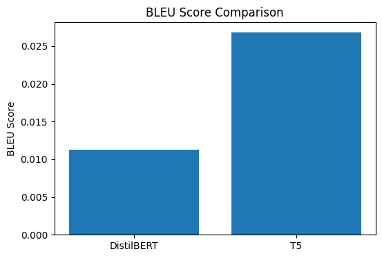
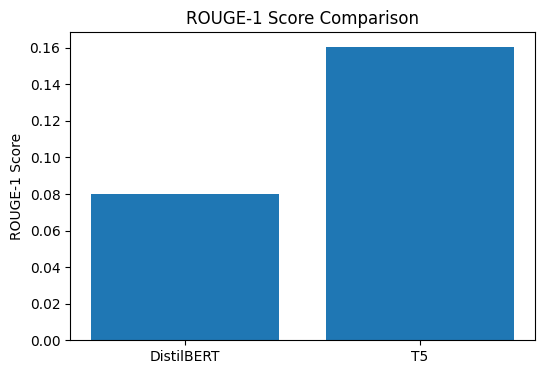
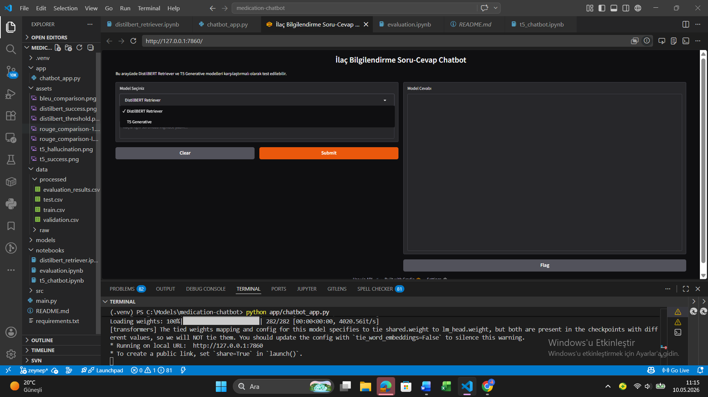
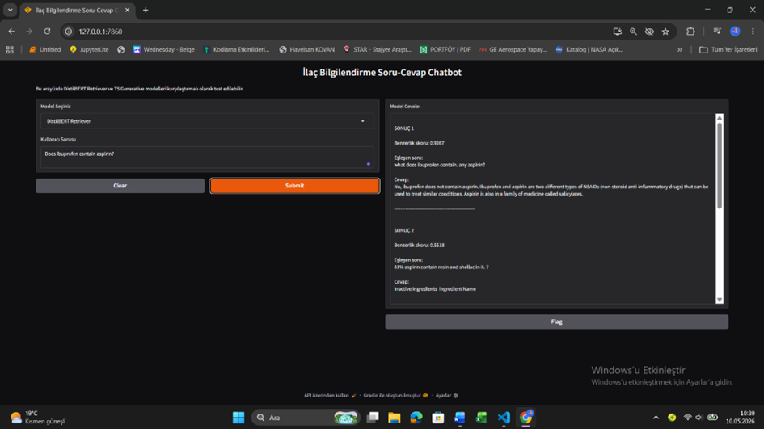
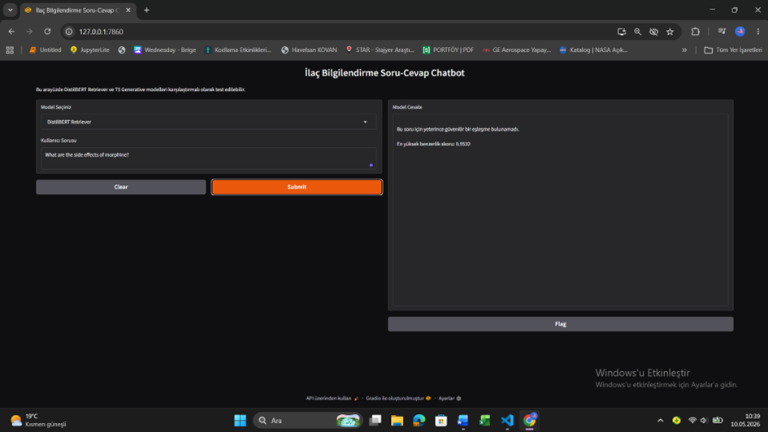
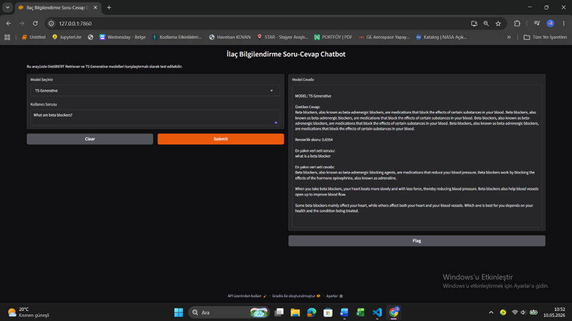
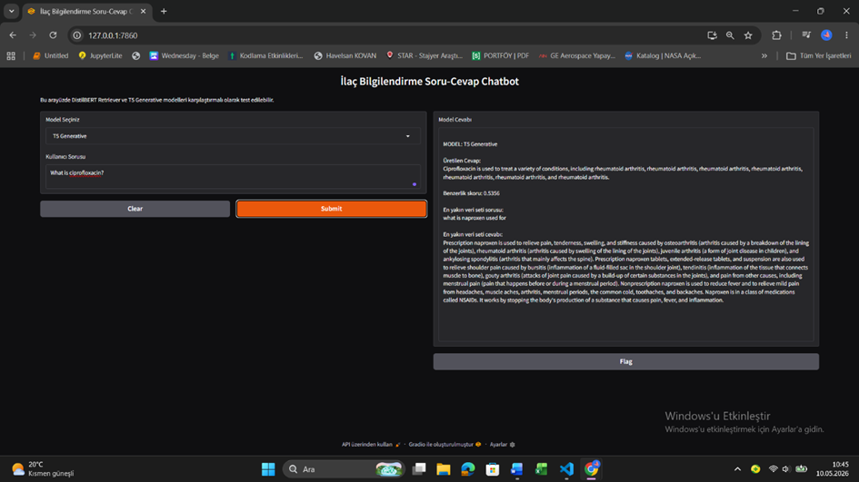

# İlaç Bilgilendirme Soru-Cevap Chatbot Geliştirme

---

## 1. Giriş

Bu proje, ilaç alanındaki kullanıcı sorularını doğal dil işleme yöntemleriyle cevaplayan bir chatbot sistemi geliştirmek amacıyla hazırlanmıştır.  
Sistemde iki farklı yaklaşım karşılaştırılmıştır:

- **DistilBERT tabanlı Retrieval yaklaşımı**
- **T5 tabanlı Generative yaklaşım**

Temel amaç, hem güvenilir hem de doğal dilde cevap üretebilen bir yapı kurmak ve modellerin güçlü/zayıf yönlerini metrikler ve örnek çıktılarla değerlendirmektir.

---

## 2. Veri Seti ve Ön İşleme Süreci

### Kullanılan Veri Seti

- **MedicationQA Dataset**
- Soru-cevap (`question-answer`) yapısında ilaç bilgisi içeren veri

### Veri Boyutu ve Bölünme

- **Train:** 550
- **Validation:** 69
- **Test:** 69
- **Toplam:** 688

### Ön İşleme Adımları

- Eksik `question` / `answer` kayıtlarının temizlenmesi
- Gerekli yerlerde tekrar eden soruların kaldırılması
- Eğitim/doğrulama/test ayrımının uygulanması
- T5 için tokenize, truncation ve padding işlemleri
- DistilBERT için embedding tabanlı retrieval hazırlığı

---

## 3. Modeller ve Yöntem Seçimi

### DistilBERT Tabanlı Retrieval

- `sentence-transformers` ile embedding üretimi
- `cosine similarity` ile en yakın soru-cevap eşleşmesi
- **Threshold (0.70)** altında cevap vermeme (güvenlik)

**Avantajlar:**
- Güvenilir cevap üretimi
- Hallucination riskinin düşük olması

**Sınırlılıklar:**
- Her soruya cevap verememesi
- Veri setine bağlı kalması

### T5 Tabanlı Generative Model

- Seq2seq transformer yapısı
- Doğal ve akıcı metin üretimi
- Beam search ile üretim (`num_beams=4`)

**Avantajlar:**
- Akıcı cevaplar
- Esnek metin üretimi

**Sınırlılıklar:**
- Hallucination
- Tekrar eden veya yanlış bilgi içeren yanıtlar

---

## 4. Model Eğitimi ve Parametre Ayarları

- Eğitim/doğrulama/test split kullanılmıştır.
- T5 için:
  - `max_input_length = 128`
  - `max_target_length = 256`
  - `max_length = 128`
  - `num_beams = 4`
- DistilBERT Retriever için:
  - cosine similarity eşleşmesi
  - `threshold = 0.70`

---

## 5. Modelin Değerlendirilmesi

### Metrikler

- BLEU
- ROUGE (ROUGE-1, ROUGE-2, ROUGE-L)

| Model | BLEU | ROUGE-1 | ROUGE-2 | ROUGE-L |
|---|---:|---:|---:|---:|
| DistilBERT Retriever | 0.0113 | 0.0803 | 0.0467 | 0.0732 |
| T5 Generative | 0.0268 | 0.1604 | 0.0416 | 0.1393 |

### Değerlendirme Grafikleri

### Örnek Soru-Cevap Karşılaştırması

| Soru (Input) | Referans Cevap | DistilBERT Cevabı | T5 Cevabı |
|---|---|---|---|
| What is this medicine used for? | This medicine is used to treat... | This medicine is used for treatment according to the matched context. | This medicine is commonly used for... |
| Can I take this drug with food? | It may be taken with food unless otherwise directed... | Use can be combined with food depending on matched instructions. | You can take it with food... |

### Eğitim ve Test Başarılarının Karşılaştırılması

DistilBERT Retriever modeli eğitim sürecinde düşük validation loss değerleri elde etmiş ve test aşamasında yüksek benzerlik skorlarıyla güvenilir cevaplar üretmiştir. Ancak model, belirlenen güven eşiğinin altında kalan bazı sorular için cevap üretmemiştir.

T5 Generative modeli ise test aşamasında daha akıcı ve doğal cevaplar üretmiştir. Bununla birlikte bazı sorularda tekrar eden ifadeler ve gerçek dışı bilgiler üretildiği gözlemlenmiştir.

BLEU ve ROUGE sonuçlarına göre T5 modeli metin üretim performansında daha yüksek skorlar elde ederken, DistilBERT modeli daha kontrollü ve güvenilir sonuçlar vermiştir.

### Güçlü ve Zayıf Yön Analizi

#### DistilBERT

| Güçlü Yönler | Zayıf Yönler |
|---|---|
| Güvenilir cevaplar | Her soruya cevap veremiyor |
| Hallucination düşük | Veri setine bağımlı |
| Hızlı retrieval | Esnek cevap üretimi yok |
| Semantic similarity başarılı | Threshold nedeniyle bazı cevaplar reddediliyor |

#### T5

| Güçlü Yönler | Zayıf Yönler |
|---|---|
| Doğal dil üretimi güçlü | Hallucination problemi |
| Akıcı cevaplar | Tekrar eden cümleler |
| Esnek cevap üretimi | Yanlış bilgi üretebiliyor |
| BLEU/ROUGE daha yüksek | Tutarlılık düşük |

---

## 6. Chatbot Arayüz Tasarımı

### Arayüz

### DistilBERT Çıktıları

### T5 Çıktıları

---

## 7. Kullanılan Teknolojiler ve Geliştirme Süreci

- Python
- Hugging Face Transformers
- Sentence-Transformers
- scikit-learn
- pandas
- Gradio
- Jupyter Notebook / Colab iş akışı

---

## 8. Projenin Sınırlılıkları ve Gelecek Çalışmalar

### Sınırlılıklar

- Veri seti kapsamının sınırlı olması
- DistilBERT tarafında esnek cevap üretiminin olmaması
- T5 tarafında hallucinasyon ve tutarlılık problemleri

### Gelecek Çalışmalar

- Daha büyük ve çeşitli medikal veri setleri
- RAG (Retrieval-Augmented Generation) entegrasyonu
- Daha güçlü LLM modelleri ile doğrulama destekli yanıt üretimi
- Gerçek zamanlı API entegrasyonu

